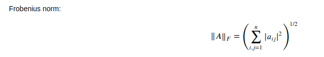
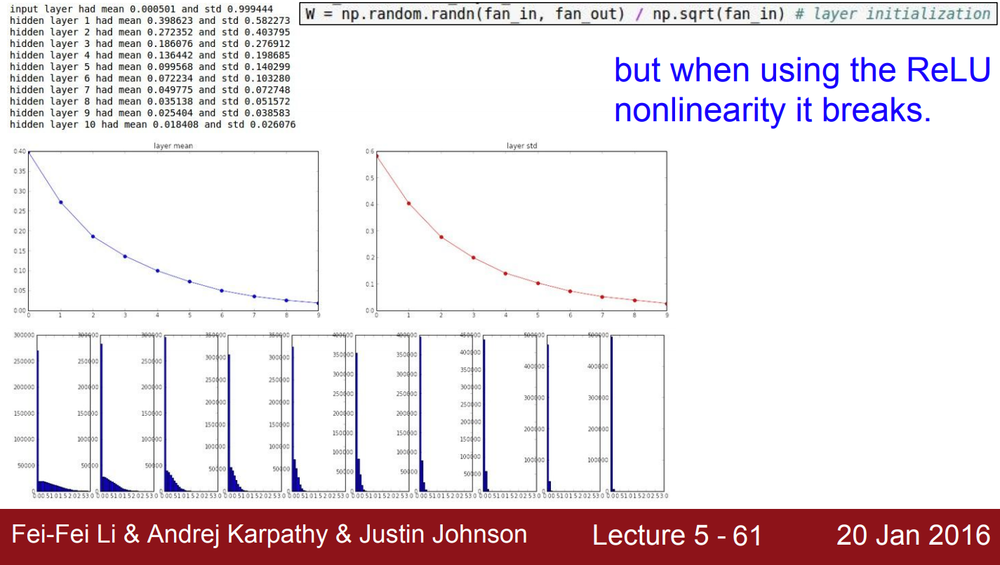
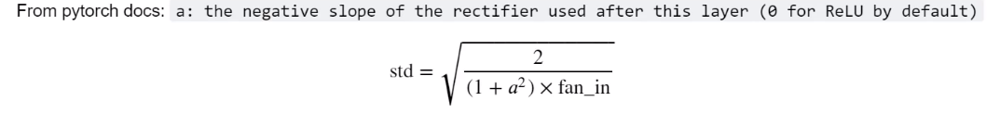
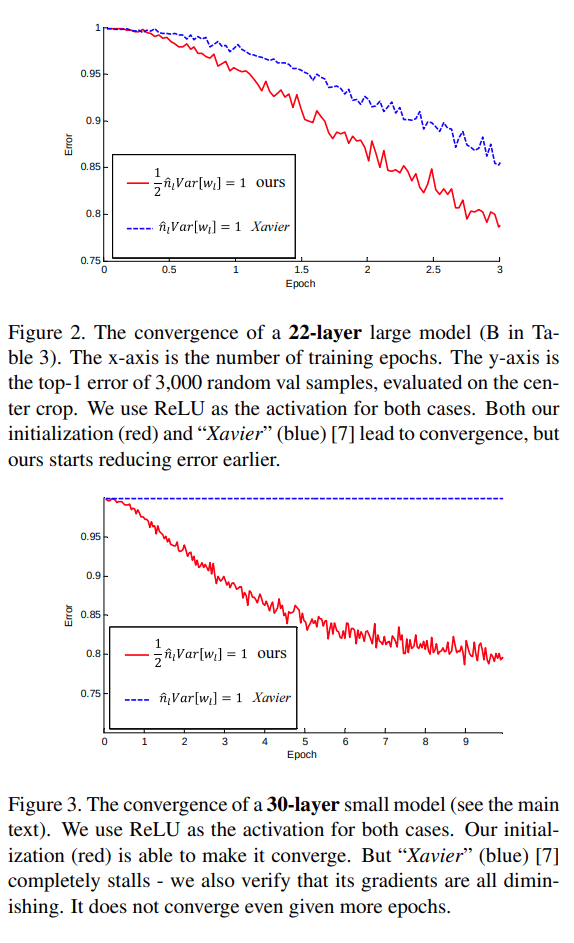
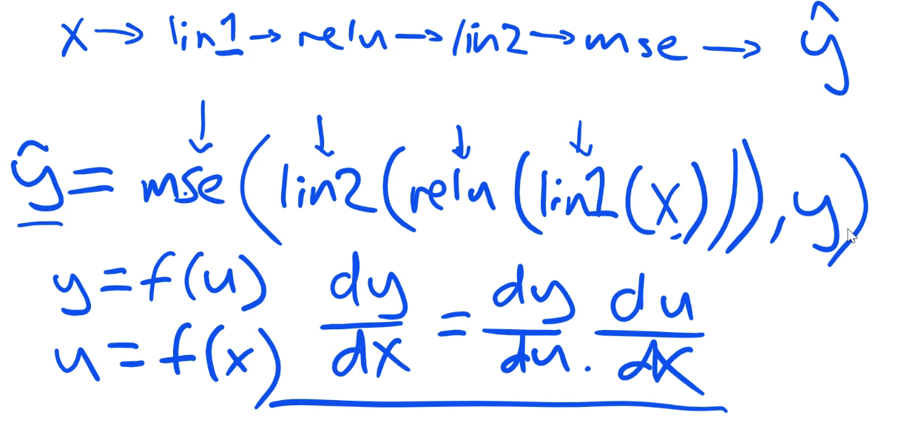

# Fastai DL from the Foundations Lesson 1 
The idea of this Repo is to manage and document the Code for the fastai Deep Learning from the foundations course and include Papers and Summaries of them when it is helpful to do so. The course focuses on building large components of the fastai library and Pytorch from scratch to allow deep understanding of the fastai and Pytorch frameworks, which enables the creation of own algorithms and makes debugging easier. 


##### The Code is based on the code in the fastai course (v3), check out [their repo](https://github.com/fastai/course-v3) which also includes part 1 which is realy focused on the practical side of things. Thank you to Jeremy, Rachel and the fastai Team for this great course. 

In order to understand the material of part 2, you should be familiar with the following concepts, depending on each category : 
##  Fundamentals
+ [Affine functions & non-linearities](https://course.fast.ai/)
+ [Parameters & activations](https://course.fast.ai/)
+ [Random weight initalization and transfer learning](https://course.fast.ai/)
+ [Stochastic gradient descent, Momentum and ADAM (a combination of RMSprop and Momentum)](https://course.fast.ai/videos/?lesson=5)
+ [Regularization techniques, specifically batch norm, dropout, weight decay and data augmentation](https://course.fast.ai/videos/?lesson=5)
+ [Embeddings](https://course.fast.ai/videos/?lesson=4)
### Vision
+ [Image classification and Regression Lesson 1](https://course.fast.ai/videos/?lesson=1) 
+ [Image classification and Regression Lesson 2](https://course.fast.ai/videos/?lesson=2) 
+ [Conv Nets](https://course.fast.ai/videos/?lesson=6)
+ [Residual and dense blocks](https://course.fast.ai/videos/?lesson=7)
+ [Segmentation : U-Net](https://course.fast.ai/videos/?lesson=3)
+ [GANs](https://course.fast.ai/videos/?lesson=7) 
### NLP 
+ [Language models & NLP](https://course.fast.ai/videos/?lesson=4)
### Tabular Data
+ [Continious & categorical variables](https://course.fast.ai/videos/?lesson=4)
+ [Collaborative filtering](https://course.fast.ai/videos/?lesson=4)


 ##  Lesson 1 
 
 As we already know DL is mainly based on Linear Algebra, so let's implement some simple Matrix Multiplication !
 We already know that ``np.matmul`` can be used for this, bur let's do it ourselves. 
 
 ```python
 def matmul(a,b):
    ar,ac = a.shape # n_rows * n_cols 
    br,bc = b.shape
    assert ac==br #check for right dimensions => output dim is ar,bc
    c = torch.zeros(ar, bc) 
    for i in range(ar):
        for j in range(bc):
            for k in range(ac): # or br
                c[i,j] += a[i,k] * b[k,j]
    return c
 
 ```
This is a very simple and inefficient implementation, which runs in 572 ms on my CPU with matrix dimensions 5x784 multiplied by 784x10. As expected the output array has 5 rows, if we used MNIST (50k) rows onw forward pass would take more than an hour which is unacceptable. 

To improve this we can pass the Code down to a lower level language (Pytorch uses [ATen](https://pytorch.org/cppdocs/) a Tensor library for this). This can be done with elementwise multiplication (also works on Tensors with rank > 1) :

```python
def matmul(a,b):
    ar,ac = a.shape
    br,bc = b.shape
    assert ac==br
    c = torch.zeros(ar, bc)
    for i in range(ar):
        for j in range(bc):
            c[i,j] = (a[i,:] * b[:,j]).sum() #row by column 
    return c
```



This is essentially using the above formula and executing it in C code, with a runtime of : 802 µs ± 60.2 µs per loop (mean ± std. dev. of 7 runs, 10 loops each). Which is about 714 times faster than the first implementation ! Wooho we are done !

### Broadcasting

Hold on not so fast ! We can still do better by removing the inner loop with Broadcasting. Broadcasting "broadcasts" the smaller array across the larger one, so they have compatible shapes, operations are vecorized so that loops are executed in C without any overhead. You can see the broadcasted version of a vector by calling :         
```python
<smaller_array>.expand_as(<larger_array>)
``` 
after expansion you can call :     
```python
<smaller_array>.storage()
```    

and you will see that no additional memory is needed. With this our matmul looks like this : 


```python
def matmul(a,b):
    ar,ac = a.shape
    br,bc = b.shape
    assert ac==br
    c = torch.zeros(ar, bc)
    for i in range(ar):
        c[i]   = (a[i ].unsqueeze(-1) * b).sum(dim=0) #unsqueeze is used to unsqueeze a to rank 2
    return c
```
This code executes in 172 µs ± 14.3 µs per loop (mean ± std. dev. of 7 runs, 10 loops each). Which means we are 3325.81 faster than in the beginning, nice. 

### Einstein Summation 

A compact representation to combine products and sums in a general way. 

```python
def matmul(a,b): return torch.einsum('ik,kj->ij', a, b)
```

This speeds up the code a little more (factor 3575 compared to the start), but more improvements can be made. 


It uses this string "mini language" (sort of like regex) to specify the multiply, it is a little bit annoying and languages like Swift will hopefully allow us to get rid of this. 


### Pytorch Op 

Pushes the code to BLAS, Hardware optimized code. We can not specify this with Pytorch, with Swift this could be optimized by the programmer more easily. A classic operation is the @ operator, it can do more than matmul (such as Batch wise, Tensor Reductions,...). 


### Matmul Summary 

| Algorithm                                   | Runtime on CPU  | Factor improvement |   
|---------------------------------------------|-----------------|--------------------|
| Naive Loops                                 | 572 ms          | 1                  |   
| Loops + elementwise row/column multiply     | 802 µs          | 714                |   
| Brodacasting                                | 172 µs          | 3326               |   
| Einstein Summation                          | 160 µs          | 3575               |   
| Pytorch's function (uses HW specific BLAS)  | 86 µs           | 6651               |   

## Now let's use it to init our weights and code RELU

### Init

We create a 2layer Net, with a hidden layer of size 50. 

m is the 2nd dimension size of our input. 

```python
nh = 50
w1 = torch.randn(m,nh)/math.sqrt(m)
b1 = torch.zeros(nh)
w2 = torch.randn(nh,1)/math.sqrt(nh)
b2 = torch.zeros(1)
```

Randn gives us weights with mean 0 and std of 1. Just using random numbers the mean and std of our output vector will be way off. In order to avoid this we divide by sqrt(m), which will keep our output mean and std in bounds. 

Another common initalization method is Xavier Initalization. Check out [Andrej Karpathy's lecture](https://www.youtube.com/watch?v=gYpoJMlgyXA&list=PLkt2uSq6rBVctENoVBg1TpCC7OQi31AlC&index=5) (starting at about 45:00) for a good explanation 
Even more advanced methods like [Fixup initalization](https://arxiv.org/abs/1901.09321) can be used. The authors of the paper are able to learn deep nets (up to 10k layers) as stable without normalization when using Fixup. 

Problem : if the variance halves each layer, the activation will vanish after some time, leading to dead neurons. 

Due to this the [2015 ImageNet ResNet winners, see 2.2 in the paper](https://arxiv.org/abs/1502.01852) suggested this :
 Up to that point init was done with random weights from Gaussian distributions, which used fixed std deviations (for example 0.01). These methods however did not allow deeper models (more than 8 layers) to converge in most cases. Due to this, in the older days models like VGG16 had to train the first 8 layers at first, in order to then initalize the next ones. As we can imagine this takes longer to train, but also may lead to a poorer local optimum. Unfortunately the Xavier init paper does not talk about non-linarities, but should not be used with ReLu like functions, as the ReLu function will half the distribution (values smaller than zero are = 0) at every step. 
 

 Looking at the distributions in the plots, you can see that the rapid decrease of the std. deviation leads to ReLu neurons activating less and less. 

 The Kaiming init paper investigates the variance at each layer and ends up suggesting the following : 

essentially it just adds the 2 in the numerator to avoid the halfing of the variance due at each step. 

A direct comparison in the paper on a 22 layer model shows the benefit, even though Xavier converges as well, Kaiming init does so significantly faster. With a deeper 30-layer model the advantage of Kaiming is even more evident. 


#### Kaiming init code : 
```python 
w1 = torch.randn(m,nh)*math.sqrt(2/m)
```

#### ReLu can be implemented easily, it clamps values below 0 and is linear otherwise : 
```python
def relu(x): return x.clamp_min(0.)
```

Leaky ReLu avoids 0-ing the gradient by using a small negative slope below 0 (0.01 usually). 

#### Therfore Kaiming init with ReLU can be implemented like this :                  
```python
w1 = torch.randn(m,nh)*math.sqrt(2./m )
t1 = relu(lin(x_valid, w1, b1))
t1.mean(),t1.std()
```

### Warning !!
The Pytorch source code for ```torch.nn.Conv2d```
uses a kaiming init with : 

```python
init.kaiming_uniform_(self.weight, a=math.sqrt(5))
 ```
 .sqrt(5) is mysterious and does not seem to be a good idea 


### Loss Function MSE
Now that we have done almost one forward pass,we still need to implement an error function. MSE Error, popular for regression tasks, can be implemented like this : 
```python
def mse(output, targ): return (output.squeeze(-1) - targ).pow(2).mean()
```

.squeeze() is used to get rid of a trainiling (,1) in this case. 

## Gradient and Backward Pass
Mathematically the Backward Pass uses the chain rule to compute all of the gradients. 


In order to Backprop effectively, we need to calc the gradients of all of our components. In our case these are our loss, activation functions (only ReLu, which is easy) and our linear layers. 

I suggest [CS 231n by Andrej Karpathy](https://www.youtube.com/watch?v=i94OvYb6noo&t=1472s) for mathematical explanation of Backprop. 

#### Let's start with MSE : 
```python
def mse_grad(inp, targ): 
    # grad of loss with respect to output of previous layer
    inp.g = 2. * (inp.squeeze() - targ).unsqueeze(-1) / inp.shape[0]
```

### Relu : 
```python
def relu_grad(inp, out):
    # grad of relu with respect to input activations
    inp.g = (inp>0).float() * out.g
```
Very simple, the gradient is either 0 or 1. In the Leaky Relu Case it's either -0.01 or 1. 

### Linear Layers
```python
def lin_grad(inp, out, w, b):
    # grad of matmul with respect to input
    inp.g = out.g @ w.t() #matrix prod with the transpose 
    w.g = (inp.unsqueeze(-1) * out.g.unsqueeze(1)).sum(0)
    b.g = out.g.sum(0)
```

### Forward and Backward Pass
```python
def forward_and_backward(inp, targ):
    # forward pass:
    l1 = inp @ w1 + b1
    l2 = relu(l1)
    out = l2 @ w2 + b2
    # we don't actually need the loss in backward!
    loss = mse(out, targ)
    
    # backward pass, just reverse order:
    mse_grad(out, targ)
    lin_grad(l2, out, w2, b2)
    relu_grad(l1, l2)
    lin_grad(inp, l1, w1, b1)
```

### In order to check our results, we can use Pytorch  : 

We can control our results with Pytorch auto_grad() function 

```python
xt2 = x_train.clone().requires_grad_(True)
w12 = w1.clone().requires_grad_(True)
w22 = w2.clone().requires_grad_(True)
b12 = b1.clone().requires_grad_(True)
b22 = b2.clone().requires_grad_(True)
```

.requires_grad(True) turns a tensor in to an autograd so it can keep track of each step

### Refactor

It's always good to refactor our code. This can be done by creating classes and using our functions. One for forward and one for backward pass. 

```python
class Relu():
    def __call__(self, inp):
        self.inp = inp
        self.out = inp.clamp_min(0.)-0.5
        return self.out
    
    def backward(self): self.inp.g = (self.inp>0).float() * self.out.g
```

```python
class Lin():
    def __init__(self, w, b): self.w,self.b = w,b
        
    def __call__(self, inp):
        self.inp = inp
        self.out = inp@self.w + self.b
        return self.out
    
    def backward(self):
        self.inp.g = self.out.g @ self.w.t()
        # Creating a giant outer product, just to sum it, is inefficient!
        self.w.g = (self.inp.unsqueeze(-1) * self.out.g.unsqueeze(1)).sum(0)
        self.b.g = self.out.g.sum(0)
```

```python
class Mse():
    def __call__(self, inp, targ):
        self.inp = inp
        self.targ = targ
        self.out = (inp.squeeze() - targ).pow(2).mean()
        return self.out
    
    def backward(self):
        self.inp.g = 2. * (self.inp.squeeze() - self.targ).unsqueeze(-1) / self.targ.shape[0]
```

Lastly we create a model class. 

```python
class Model():
    def __init__(self, w1, b1, w2, b2):
        self.layers = [Lin(w1,b1), Relu(), Lin(w2,b2)]
        self.loss = Mse()
        
    def __call__(self, x, targ):
        for l in self.layers: x = l(x)
        return self.loss(x, targ)
    
    def backward(self):
        self.loss.backward()
        for l in reversed(self.layers): l.backward()
```


The execution times is to slow and we want to avoid the __call__() declarations so we define a module class  

### further Refactor

```python
class Module():
    def __call__(self, *args):
        self.args = args
        self.out = self.forward(*args)
        return self.out
    
    def forward(self): raise Exception('not implemented')
    def backward(self): self.bwd(self.out, *self.args)
```

```python
class Relu(Module):
    def forward(self, inp): return inp.clamp_min(0.)-0.5
    def bwd(self, out, inp): inp.g = (inp>0).float() * out.g
```

```python
class Lin(Module):
    def __init__(self, w, b): self.w,self.b = w,b
        
    def forward(self, inp): return inp@self.w + self.b
    
    def bwd(self, out, inp):
        inp.g = out.g @ self.w.t()
        self.w.g = torch.einsum("bi,bj->ij", inp, out.g)
        self.b.g = out.g.sum(0)
```

```python
class Mse(Module):
    def forward (self, inp, targ): return (inp.squeeze() - targ).pow(2).mean()
    def bwd(self, out, inp, targ): inp.g = 2*(inp.squeeze()-targ).unsqueeze(-1) / targ.shape[0]
```

```python
class Model():
    def __init__(self):
        self.layers = [Lin(w1,b1), Relu(), Lin(w2,b2)]
        self.loss = Mse()
        
    def __call__(self, x, targ):
        for l in self.layers: x = l(x)
        return self.loss(x, targ)
    
    def backward(self):
        self.loss.backward()
        for l in reversed(self.layers): l.backward()
```

Now we can call the forward and backprop passes for our model easily. 

### Summary

To summarize we implemented nn.Linear and nn.Module and will be able to write the train loop next lesson !
