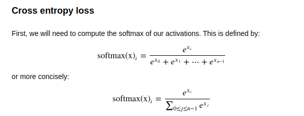
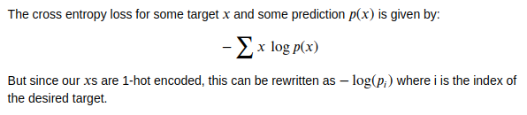
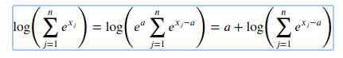
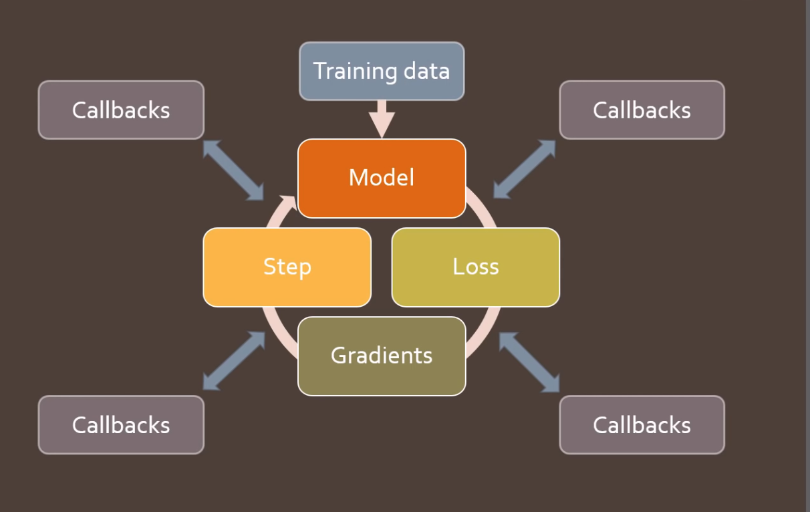

# Lesson 2 How to train your model 

## Loss

For our Classification task, we will be using Cross Entropy Loss (also called Log Loss) ourselves. 
We define a simple Linear Model for our task. We will be using the Pytorch functions, as we already implemented those in Lesson 1 : 

```python
class Model(nn.Module): 
    def __init__(self,in_dim,nh,out_dim): 
        super().__init__()
        self.layers = [nn.Linear(in_dim,nh), nn.ReLu(),nn.Linear(nh,out_dim)]
    def __call__(self,x): 
        for i in self.layers: x = l(x)
        return x
```

Since we are using Softmax, we need to compute it's output first : 



In practice we need it's log, the code is simple : 

```python 
def log_softmax(x) : return (x.exp()/x.exp().sum(-1,keepdim=True))).log()
```

Using simple log-math 
```
log(a/b) = log(a) - log(b)
``` 
Which leads to in pseudo code : 
```
log(x.exp()) - log(x.exp().sum())
```
We can simplify this log_softmax function, like so : 
```python 
def log_softmax(x) : return x - x.exp().sum(-1,keepdim=True).log()
```



Using numpy [integer array indexing](https://docs.scipy.org/doc/numpy-1.13.0/reference/arrays.indexing.html#integer-array-indexing) we can compute our negative log likelihood like so by passing our softmax output : 

```python 
def negative_log_likelihood(input,target): 
    return -input[range(target.shape[0]), target].mean()
```

However we can compute the log of the sum of exponentials in a more stable way to avoid an overflow of big activations, with the [LogSumExp trick](https://en.wikipedia.org/wiki/LogSumExp) : 

```python 
def logsumexp(exp): 
    a= x.max(-1)[0] #maximum of x(j)  
    return a + (x-a[:,None]).exp().sum(-1).log()
``` 

Updating our softmax again, this leads to : 

```python 
def log_softmax(x): 
    return x - x.logsumexp(-1,keepdim=True)
```

x.logsumexp() is the Pytorch function in this case. 
In order to compare our function with Pytorch, we can use 

```python 
test_near(logsumexp(pred), pred.logsumexp(-1))
```

test_near will throw an AssertionError if they are not equal to each other. 

Now we succesfully implemented ```F.cross_entropy(pred,y_train)```, which is made out of ```F.log_softmax``` and ```F.nll_loss```

The accuracy can be calculated with : 
```python 
def accuracy(out, yb): return (torch.argmax(out, dim=1)==yb).float().mean()
``` 

## Training Loop

Basically the training loop repeats over the following steps:
- get the output of the model on a batch of inputs
- compare the output to the labels we have and compute a loss
- calculate the gradients of the loss with respect to every parameter of the model
- update said parameters with those gradients to make them a little bit better

Now we can implement our Training Loop : 

```python 
for epoch in range(epochs):
    for i in range((n-1)//bs + 1):
#       slice dataset in batches
        start_i = i*bs
        end_i = start_i+bs
        xb = x_train[start_i:end_i]
        yb = y_train[start_i:end_i]
        loss = loss_func(model(xb), yb)

        loss.backward()
        with torch.no_grad():
            for l in model.layers:
                if hasattr(l, 'weight'):
                    l.weight -= l.weight.grad * lr
                    l.bias   -= l.bias.grad   * lr
                    l.weight.grad.zero_()
                    l.bias  .grad.zero_()
```

This looks kind of messy. Since our parameters can all be stored in a model class, we can loop over them and update them easily. However we need to implement a dummy Module first : 

## Module and improved training loop

```python 
class DummyModule():
    def __init__(self, n_in, nh, n_out):
        self._modules = {}
        self.l1 = nn.Linear(n_in,nh)
        self.l2 = nn.Linear(nh,n_out)
        
    def __setattr__(self,k,v): #this is called everytime self is assigned 
        if not k.startswith("_"): self._modules[k] = v # just checks if it doesn't start with _ to avoid calling  python _modules recursively 
        super().__setattr__(k,v) #super class is python object 
        
    def __repr__(self): return f'{self._modules}'
    
    def parameters(self):
        for l in self._modules.values():
            for p in l.parameters(): yield p
```

for simplicity we can now use the Pytorch Module 

```python 
class Model(nn.Module): 
    def __init__(self,layers): 
        super().__init__() #initalizes self._modules 
        self.layers = layers 
        for i,l in enumerate(self.layers) : self.add_module(f'layer_{i}',l)
    def __call__(): 
        for layer in self.layers: x = l(x)
        return x
```


now we can call the training more conveniently : 


```python 
for epoch in range(epochs):
    for i in range((n-1)//bs + 1):
#       slice dataset in batches
        start_i = i*bs
        end_i = start_i+bs
        xb = x_train[start_i:end_i]
        yb = y_train[start_i:end_i]
        loss = loss_func(model(xb), yb)

        loss.backward()
        with torch.no_grad()
        for param in model.parameters(): param -= lr * param.grad
```

We can make it even easier with `nn.ModuleList` to recreate `nn.Sequential`.

```python 
class SequentialModel(nn.Module):
    def __init__(self, layers):
        super().__init__()
        self.layers = nn.ModuleList(layers)
        
    def __call__(self, x):
        for l in self.layers : x = l(x)
        return x
``` 

Let's replace our previous manually coded optimization step:

```python
with torch.no_grad():
    for p in model.parameters(): p -= p.grad * lr
    model.zero_grad()
```

and instead use just:

```python
opt.step()
opt.zero_grad()
```

## Optimizer 

By creating our own Optimizer Function 

```python 
class Optimizer():
    def __init__(self, params, lr=0.5): self.params,self.lr=list(params),lr
        
    def step(self):
        with torch.no_grad():
            for p in self.params: p -= p.grad * lr

    def zero_grad(self):
        for p in self.params: p.grad.data.zero_()
```

PyTorch already provides optimizers, like optim.SGD and optim.Adam, which also handles more stuff. 

Now we can further simplify our Training loop : 
```python 
for epoch in range(epochs):
    for i in range((n-1)//bs + 1):
        start_i = i*bs
        end_i = start_i+bs
        xb = x_train[start_i:end_i]
        yb = y_train[start_i:end_i]
        pred = model(xb)
        loss = loss_func(pred, yb)

        loss.backward()
        opt.step()
        opt.zero_grad()
```

When implementing stuff yourself, it's always good to put some tests in. Like checking the accuracy for example. 

## Dataset and DataLoader

### Dataset

We can further simplify this by converting 
```python 
xb = x_train[start_i:end_i]
yb = y_train[start_i:end_i]
``` 

with a Dataset Class : 

```python 
class Dataset(): 
    def __init__(self,x,y): self.x,self.y = x,y
    def __len__(self): return len(self.x)
    def __getitem__(self,i): return self.x[i], self.y[i]

train_ds,valid_ds = Dataset(x_train, y_train),Dataset(x_valid, y_valid)

```
Now we can call our loop like this : 

```python 
for e in range(epochs): 
    for i in range((n-1)//bs+1): 
        x,y =  train_ds[i*bs:i*bs+bs]
        pred = model(x)
        loss = loss_func(pred,y)
        loss.backward()
        opt.step()
        opt.zero_grad()
```

### DataLoader

We can make this even easier with a Dataloader to iterate over our Dataset automatically. 

```python
class Dataloader : 
    def __init__(self, ds, bs): self.ds,self.bs = ds,bs
    def __iter__(self):
        for i in range(0, len(self.ds), self.bs): yield self.ds[i:i+self.bs]
```

`yield` is used, in order to produce a series of values over time. We can use the Dataloader with next and iter : 


```python 
train_dl = DataLoader(train_ds, bs)
valid_dl = DataLoader(valid_ds, bs)

xb,yb = next(iter(valid_dl))
```

now we can put our train loop in a wonderful function : 

```python
def fit():
    for epoch in range(epochs):
        for xb,yb in train_dl:
            pred = model(xb)
            loss = loss_func(pred, yb)
            loss.backward()
            opt.step()
            opt.zero_grad()
```

## Sampler

In order to have a random order, we can implement a Sampler class : 


```python
class Sampler():
    def __init__(self, ds, bs, shuffle=False):
        self.n,self.bs,self.shuffle = len(ds),bs,shuffle
        
    def __iter__(self):
        self.idxs = torch.randperm(self.n) if self.shuffle else torch.arange(self.n)
        for i in range(0, self.n, self.bs): yield self.idxs[i:i+self.bs]
```

Now we can change our DataLoader to include our sampler as an argument. 

```python 
def collate(b):
    xs,ys = zip(*b)
    return torch.stack(xs),torch.stack(ys)

class DataLoader():
    def __init__(self, ds, sampler, collate_fn=collate):
        self.ds,self.sampler,self.collate_fn = ds,sampler,collate_fn
        
    def __iter__(self):
        for s in self.sampler: yield self.collate_fn([self.ds[i] for i in s])
```

`collate` stacks tensors, we can also add padding, etc ...
PyTorch does the same thing as well, but also adds `num_workers` which can be used to start several threads and run more efficiently  : 

```python 
train_dl = DataLoader(train_ds, sampler=train_samp, collate_fn=collate,num_workers=num_workers)
valid_dl = DataLoader(valid_ds, sampler=valid_samp, collate_fn=collate,num_workers=num_workers)
```

## With Val Set 

Using best practices we should add a val set to store our best model and test during training : 

```python
def fit(epochs, model, loss_func, opt, train_dl, valid_dl):
    for epoch in range(epochs):
        # Handle batchnorm / dropout
        model.train()
#         print(model.training)
        for xb,yb in train_dl:
            loss = loss_func(model(xb), yb)
            loss.backward()
            opt.step()
            opt.zero_grad()

        model.eval()
#         print(model.training)
        with torch.no_grad():
            tot_loss,tot_acc = 0.,0.
            for xb,yb in valid_dl:
                pred = model(xb)
                tot_loss += loss_func(pred, yb)
                tot_acc  += accuracy (pred,yb)
        nv = len(valid_dl)
        print(epoch, tot_loss/nv, tot_acc/nv)
    return tot_loss/nv, tot_acc/nv
```

I divided it in to a train and val Function for better readability : 

```python
def train(model, loss_func, opt, train_dl): 
    model.train()
    for xb,yb in train_dl : 
        loss = loss_func(model(xb),yb)
        loss.backward()
        opt.step()
        opt.zero_grad()

def val(epoch,model, loss_func, valid_dl): 
    model.eval()
    with torch.no_grad(): 
        total_loss, total_acc = 0.,0.
        for xb,yb in valid_dl: 
            total_loss += loss_func(model(xb),yb)
            total_acc += accuracy(model(xb),yb)
    iterations = len(valid_dl)
    print(epoch, total_loss/iterations, total_acc/iterations)    
    return total_loss, total_acc, iterations

def fit(epochs,model,loss_func,opt,train_dl,valid_dl): 
    for epoch in range(epochs) : 
        train(model,loss_func,opt,train_dl)
        loss,acc, nv = val(epoch,model,loss_func,valid_dl) 
    return loss/(nv), acc/(nv)
```

## Powerful Training Loops with Callbacks

In order to customize out training loop in many ways (regularization techniques, visualization, early stopping,...), we want to be able to do so easily without having to write a huge loop function all the time that is hard to read and update. For this fastai uses something called callbacks : 



### Databunch 
This can be used to store our info and doesn't have any real logic. 

```python 
class DataBunch():
    def __init__(self, train_dl, valid_dl, c=None):
        self.train_dl,self.valid_dl,self.c = train_dl,valid_dl,c
        
    @property
    def train_ds(self): return self.train_dl.dataset
        
    @property
    def valid_ds(self): return self.valid_dl.dataset

data = DataBunch(*get_dls(train_ds, valid_ds, bs), c) #c is max y value 

#further storage wrappers
def get_model(data, lr=0.5, nh=50):
    m = data.train_ds.x.shape[1]
    model = nn.Sequential(nn.Linear(m,nh), nn.ReLU(), nn.Linear(nh,data.c))
    return model, optim.SGD(model.parameters(), lr=lr)

class Learner():
    def __init__(self, model, opt, loss_func, data):
        self.model,self.opt,self.loss_func,self.data = model,opt,loss_func,data

```
With our previous training loop modified a bit we can add Callbacks now,  : 

```python 
def one_batch(xb, yb, cb):
    if not cb.begin_batch(xb,yb): return
    loss = cb.learn.loss_func(cb.learn.model(xb), yb)
    if not cb.after_loss(loss): return
    loss.backward()
    if cb.after_backward(): cb.learn.opt.step()
    if cb.after_step(): cb.learn.opt.zero_grad()

def all_batches(dl, cb):
    for xb,yb in dl:
        one_batch(xb, yb, cb)
        if cb.do_stop(): return

def fit(epochs, learn, cb):
    if not cb.begin_fit(learn): return
    for epoch in range(epochs):
        if not cb.begin_epoch(epoch): continue
        all_batches(learn.data.train_dl, cb)
        
        if cb.begin_validate():
            with torch.no_grad(): all_batches(learn.data.valid_dl, cb)
        if cb.do_stop() or not cb.after_epoch(): break
    cb.after_fit()
```


### add Callbacks


```python
class Callback():
    def begin_fit(self, learn):
        self.learn = learn
        return True
    def after_fit(self): return True
    def begin_epoch(self, epoch):
        self.epoch=epoch
        return True
    def begin_validate(self): return True
    def after_epoch(self): return True
    def begin_batch(self, xb, yb):
        self.xb,self.yb = xb,yb
        return True
    def after_loss(self, loss):
        self.loss = loss
        return True
    def after_backward(self): return True
    def after_step(self): return True 
```

### Callback Hander 

```python 
class CallbackHandler():
    def __init__(self,cbs=None):
        self.cbs = cbs if cbs else []

    def begin_fit(self, learn):
        self.learn,self.in_train = learn,True
        learn.stop = False
        res = True
        for cb in self.cbs: res = res and cb.begin_fit(learn)
        return res

    def after_fit(self):
        res = not self.in_train
        for cb in self.cbs: res = res and cb.after_fit()
        return res
    
    def begin_epoch(self, epoch):
        self.learn.model.train()
        self.in_train=True
        res = True
        for cb in self.cbs: res = res and cb.begin_epoch(epoch)
        return res

    def begin_validate(self):
        self.learn.model.eval()
        self.in_train=False
        res = True
        for cb in self.cbs: res = res and cb.begin_validate()
        return res

    def after_epoch(self):
        res = True
        for cb in self.cbs: res = res and cb.after_epoch()
        return res
    
    def begin_batch(self, xb, yb):
        res = True
        for cb in self.cbs: res = res and cb.begin_batch(xb, yb)
        return res

    def after_loss(self, loss):
        res = self.in_train
        for cb in self.cbs: res = res and cb.after_loss(loss)
        return res

    def after_backward(self):
        res = True
        for cb in self.cbs: res = res and cb.after_backward()
        return res

    def after_step(self):
        res = True
        for cb in self.cbs: res = res and cb.after_step()
        return res
    
    def do_stop(self):
        try:     return self.learn.stop
        finally: self.learn.stop = False
```

### Callback Test

```python
class TestCallback(Callback):
    def begin_fit(self,learn):
        super().begin_fit(learn)
        self.n_iters = 0
        return True
        
    def after_step(self):
        self.n_iters += 1
        print(self.n_iters)
        if self.n_iters>=10: self.learn.stop = True
        return True
```

These methods are checked for in our `one_batch` function and are executed in our training loop. 

### Callback Simplification 

We do on not need to implement each function seperately by using a __call__ function :

```python
def __call__(self, cb_name):
        for cb in sorted(self.cbs, key=lambda x: x._order):
            f = getattr(cb, cb_name, None)
            if f and f(): return True
        return False
```

This allows is to recreate the Calbacks in a better way : 

```python
#export
import re

_camel_re1 = re.compile('(.)([A-Z][a-z]+)')
_camel_re2 = re.compile('([a-z0-9])([A-Z])')
def camel2snake(name):
    s1 = re.sub(_camel_re1, r'\1_\2', name)
    return re.sub(_camel_re2, r'\1_\2', s1).lower()

class Callback():
    _order=0
    def set_runner(self, run): self.run=run
    def __getattr__(self, k): return getattr(self.run, k)
    @property
    def name(self):
        name = re.sub(r'Callback$', '', self.__class__.__name__)
        return camel2snake(name or 'callback')

#export
class TrainEvalCallback(Callback):
    def begin_fit(self):
        self.run.n_epochs=0.
        self.run.n_iter=0
    
    def after_batch(self):
        if not self.in_train: return
        self.run.n_epochs += 1./self.iters
        self.run.n_iter   += 1
        
    def begin_epoch(self):
        self.run.n_epochs=self.epoch
        self.model.train()
        self.run.in_train=True

    def begin_validate(self):
        self.model.eval()
        self.run.in_train=False

class TestCallback(Callback):
    def after_step(self):
        if self.train_eval.n_iters>=10: return True

#export
class Runner():
    def __init__(self, cbs=None, cb_funcs=None):
        cbs = listify(cbs)
        for cbf in listify(cb_funcs):
            cb = cbf()
            setattr(self, cb.name, cb)
            cbs.append(cb)
        self.stop,self.cbs = False,[TrainEvalCallback()]+cbs

    @property
    def opt(self):       return self.learn.opt
    @property
    def model(self):     return self.learn.model
    @property
    def loss_func(self): return self.learn.loss_func
    @property
    def data(self):      return self.learn.data

    def one_batch(self, xb, yb):
        self.xb,self.yb = xb,yb
        if self('begin_batch'): return
        self.pred = self.model(self.xb)
        if self('after_pred'): return
        self.loss = self.loss_func(self.pred, self.yb)
        if self('after_loss') or not self.in_train: return
        self.loss.backward()
        if self('after_backward'): return
        self.opt.step()
        if self('after_step'): return
        self.opt.zero_grad()

    def all_batches(self, dl):
        self.iters = len(dl)
        for xb,yb in dl:
            if self.stop: break
            self.one_batch(xb, yb)
            self('after_batch')
        self.stop=False

    def fit(self, epochs, learn):
        self.epochs,self.learn = epochs,learn

        try:
            for cb in self.cbs: cb.set_runner(self)
            if self('begin_fit'): return
            for epoch in range(epochs):
                self.epoch = epoch
                if not self('begin_epoch'): self.all_batches(self.data.train_dl)

                with torch.no_grad(): 
                    if not self('begin_validate'): self.all_batches(self.data.valid_dl)
                if self('after_epoch'): break
            
        finally:
            self('after_fit')
            self.learn = None
```


In order to track our stats we will add a third Callback to see them, it will make us of a ckass that computes these.

```python 
class AvgStats():
    def __init__(self, metrics, in_train): self.metrics,self.in_train = listify(metrics),in_train
    
    def reset(self):
        self.tot_loss,self.count = 0.,0
        self.tot_mets = [0.] * len(self.metrics)
        
    @property
    def all_stats(self): return [self.tot_loss.item()] + self.tot_mets
    @property
    def avg_stats(self): return [o/self.count for o in self.all_stats]
    
    def __repr__(self):
        if not self.count: return ""
        return f"{'train' if self.in_train else 'valid'}: {self.avg_stats}"

    def accumulate(self, run):
        bn = run.xb.shape[0]
        self.tot_loss += run.loss * bn
        self.count += bn
        for i,m in enumerate(self.metrics):
            self.tot_mets[i] += m(run.pred, run.yb) * bn

class AvgStatsCallback(Callback):
    def __init__(self, metrics):
        self.train_stats,self.valid_stats = AvgStats(metrics,True),AvgStats(metrics,False)
        
    def begin_epoch(self):
        self.train_stats.reset()
        self.valid_stats.reset()
        
    def after_loss(self):
        stats = self.train_stats if self.in_train else self.valid_stats
        with torch.no_grad(): stats.accumulate(self.run)
    
    def after_epoch(self):
        print(self.train_stats)
        print(self.valid_stats)
```

Now we can finally call our methods and start trainig. 

```python 
learn = Learner(*get_model(data), loss_func, data)
stats = AvgStatsCallback([accuracy])
run = Runner(cbs=stats)
run.fit(2, learn)
loss,acc = stats.valid_stats.avg_stats
```

Using partial we can create a Function that can create a callback function : 

```python 
from functools import partial
acc_cbf = partial(AvgStatsCallback,accuracy)
run = Runner(cb_funcs=acc_cbf)
```

This way we can create Callback funcs easily, e.g. by using a list. 

### Annealing 

We define two new callbacks: the Recorder to save track of the loss and our scheduled learning rate, and a ParamScheduler that can schedule any hyperparameter as long as it's registered in the state_dict of the optimizer. 

```python
class Recorder(Callback):
    def begin_fit(self): self.lrs,self.losses = [],[]

    def after_batch(self):
        if not self.in_train: return
        self.lrs.append(self.opt.param_groups[-1]['lr'])
        self.losses.append(self.loss.detach().cpu())        

    def plot_lr  (self): plt.plot(self.lrs)
    def plot_loss(self): plt.plot(self.losses)

class ParamScheduler(Callback):
    _order=1
    def __init__(self, pname, sched_func): self.pname,self.sched_func = pname,sched_func

    def set_param(self):
        for pg in self.opt.param_groups:
            pg[self.pname] = self.sched_func(self.n_epochs/self.epochs)
            
    def begin_batch(self): 
        if self.in_train: self.set_param()

def sched_lin(start, end):
    def _inner(start, end, pos): return start + pos*(end-start)
    return partial(_inner, start, end)

def annealer(f):
    def _inner(start, end): return partial(f, start, end)
    return _inner

@annealer 
def sched_lin(start, end, pos): return start + pos*(end-start)

```

The Decorator annealer passes sched_lin in annealer and replaces sched_lin() definition with what annealer returns. 

### other scheduler funcs

```python
@annealer
def sched_cos(start, end, pos): return start + (1 + math.cos(math.pi*(1-pos))) * (end-start) / 2
@annealer
def sched_no(start, end, pos):  return start
@annealer
def sched_exp(start, end, pos): return start * (end/start) ** pos

def cos_1cycle_anneal(start, high, end):
    return [sched_cos(start, high), sched_cos(high, end)]

#This monkey-patch is there to be able to plot tensors
torch.Tensor.ndim = property(lambda x: len(x.shape))
```

plot them 

```python
annealings = "NO LINEAR COS EXP".split()

a = torch.arange(0, 100)
p = torch.linspace(0.01,1,100)

fns = [sched_no, sched_lin, sched_cos, sched_exp]
for fn, t in zip(fns, annealings):
    f = fn(2, 1e-2)
    plt.plot(a, [f(o) for o in p], label=t)
plt.legend()
```

Combine Schedulers with a function : 

```python
def combine_scheds(pcts, scheds):
    assert sum(pcts) == 1.
    pcts = tensor([0] + listify(pcts))
    assert torch.all(pcts >= 0)
    pcts = torch.cumsum(pcts, 0)
    def _inner(pos):
        idx = (pos >= pcts).nonzero().max()
        actual_pos = (pos-pcts[idx]) / (pcts[idx+1]-pcts[idx])
        return scheds[idx](actual_pos)
    return _inner

sched = combine_scheds([0.3, 0.7], [sched_cos(0.3, 0.6), sched_cos(0.6, 0.2)]) 
```

Here is an example: use 30% of the budget to go from 0.3 to 0.6 following a cosine, then the last 70% of the budget to go from 0.6 to 0.2, still following a cosine. Train for a long time @ high lr, then switch to lower lr with cosine 1 cycle schedules. 

Now we can train with our Callbacks and cosine scheduling. 

```python
cbfs = [Recorder,
        partial(AvgStatsCallback,accuracy),
        partial(ParamScheduler, 'lr', sched)]
    
learn = create_learner(get_model_func(0.3), loss_func, data)
run = Runner(cb_funcs=cbfs)

run.fit(3, learn)
```

These Callbacks can also be used to move compute to our GPU !